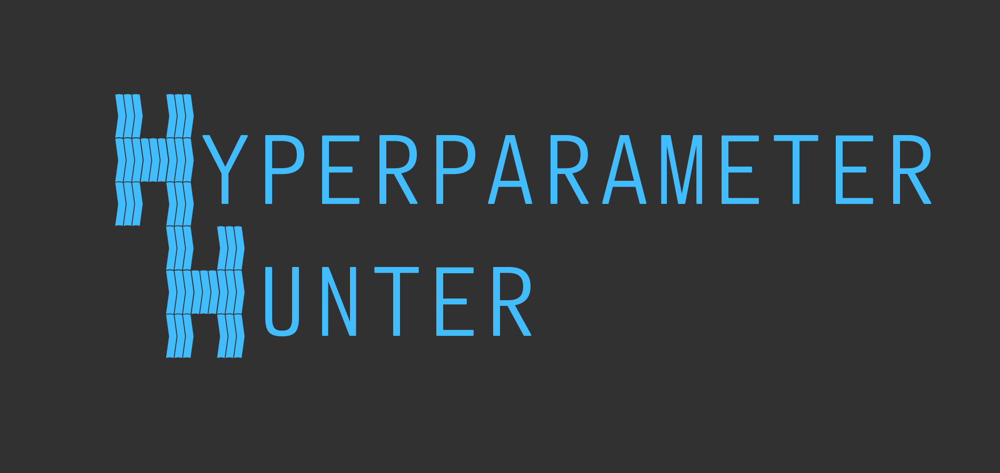

HyperparameterHunter
====================



[](https://www.paypal.com/cgi-bin/webscr?cmd=_s-xclick&hosted_button_id=Q3EX3PQUV256G)

HyperparameterHunter provides wrappers for executing machine learning algorithms that
automatically save the testing conditions/hyperparameters, results, predictions, and
other data for a wide range of algorithms from many different libraries in a unified
format. HyperparameterHunter aims to simplify the experimentation and hyperparameter
tuning process by allowing you to spend less time doing the annoying tasks, and more time
doing the important ones.

* **Source:** https://github.com/HunterMcGushion/hyperparameter_hunter
* **Documentation:** [https://hyperparameter-hunter.readthedocs.io](https://hyperparameter-hunter.readthedocs.io/en/latest/index.html)

Features
--------
* Truly informed hyperparameter optimization that automatically uses past Experiments
* Eliminate boilerplate code for cross-validation loops, predicting, and scoring
* Stop worrying about keeping track of hyperparameters, scores, or re-running the same Experiments

Getting Started
---------------
Set up an Environment to organize Experiments and Optimization

```python
from hyperparameter_hunter import Environment, CrossValidationExperiment
import pandas as pd
from sklearn.datasets import load_breast_cancer
from sklearn.model_selection import StratifiedKFold
from xgboost import XGBClassifier

data = load_breast_cancer
df = pd.DataFrame(data=data.data, columns=data.feature_names)
df['target'] = data.target

env = Environment(
	train_dataset=df,
	root_results_path='path/to/results/directory',
	metrics_map=['roc_auc_score'],
	cross_validation_type=StratifiedKFold,
	cross_validation_params=dict(n_splits=5, shuffle=2, random_state=32)
)
```

<div height=100%>
<object data="docs/extras/readme_code_examples.html" style="overflow:hidden; display:block; position:absolute" width=100% height=1200></object>
<!--<iframe src="docs/extras/readme_code_examples.html" frameborder=0 style="overflow:hidden; display:block; position:absolute" width=100% height=1200></iframe>-->
</div>